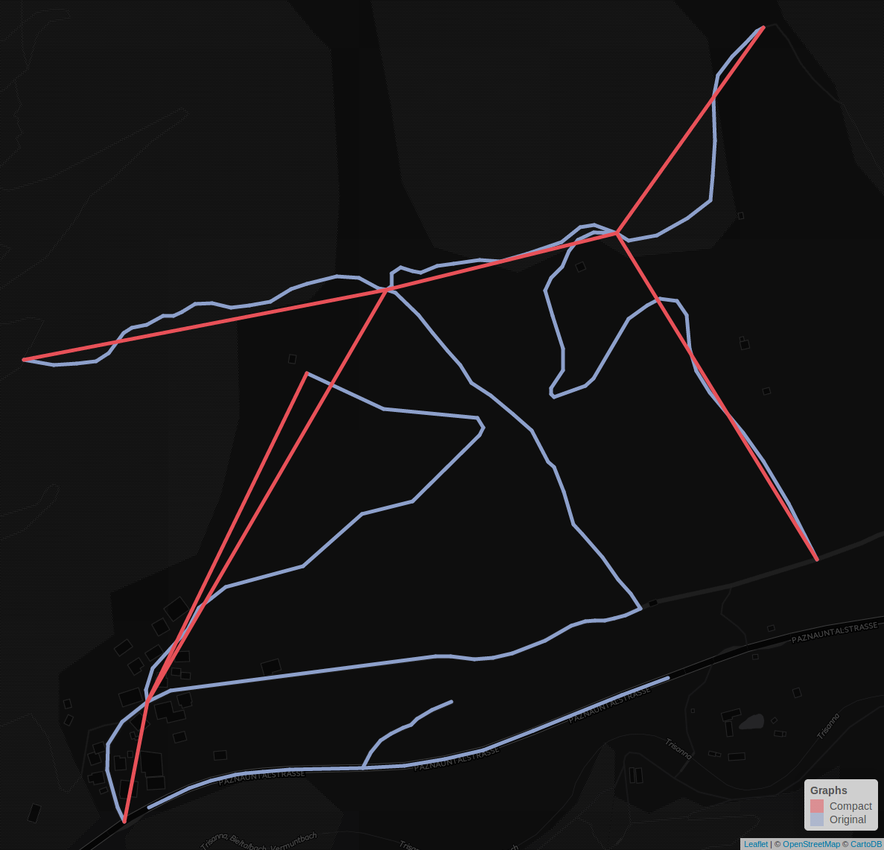

# Introduction

This package allows users to calculate traversal probabilities and the estimated
travel distance between two points on a graph based on the methods introduced in
@saerens2009randomized. It also contains methods that simplify the process of
downloading and preprocessing OpenStreetMap[^1] road data on which the routing
can be performed. This step also includes weighting the edges according to a
specified means of transport. The values used for weighting are derived from the
Routino weighting profiles[^2].  Finally, the results can be visualised with
built-in mapping functions.

## Nomenclature

"**path** `noun | \ˈpath, ˈpäth\` [...] a sequence of arcs in a network that can
be traced continuously without retracing any arc"  
@mwPath

"**route** `noun | \ˈrüt, ˈrau̇t\` [...] an established or selected course of
travel or action"  
@mwRoute

Usually, the results produced by routing software like implementations of
Dijkstra's algorithm (@dijkstra1959note) are least-cost edge sequences called
paths or routes. An overview about routing algorithms can be found in
@hall2012handbook. And while some of these rely on probabilities in order to
simulate realistic route choice behaviour, the eventual routing results are
still paths. Implementations of the Cross-Nested Logit, Probit and the Logit
Kernel model can be found in @ben2004route. It is important to clarify that the
routing results produced by this software are not paths, but a set of traversal
probabilities of all edges on the graph. For lack of more fitting terminology,
they will be referred to as routes in this paper.

# Methods

## Preprocessing

The OpenStreetMap road data can not be used in its raw form, but has to be
preprocessed first in order to produce robust results and to lower calculation
time. The preprocessing includes three steps:

- Identifying and isolating the largest connected component in the graph
- Removing vertices that are not needed to preserve the graph's topology
- Mapping the edges of the processed graph back on to the original graph

The following section illustrates the methods used for preprocessing.

### Identifying largest graph component

Graph based routing algorithms do not work on a disconnected graph. But when
downloading subsets of OpenStreetMap data based on a bounding box, the resulting
graph may consist of several disconnected components, as figure 1 illustrates.
One way to obtain a single connected component, is to identify all separate
connected components inside a bounding box, then select one and delete all
others. In this package, the selection is based on the number of vertices in the
component, which is practical for most routing applications.

```{r, fig.align="center", echo=FALSE, engine='tikz',fig.ext='svg', code=readLines("res/graph_pp1.tex"), fig.cap="Figure 1: Original data, consisting of different graph components"}
```

The following sample of pseudocode illustrates how the largest graph component
is identified.

<!-- todo: clarify: component, compact graph, neighbours, write out
pseudocode -->

```{r eval=FALSE}
    component_number = 0

    # initially, set all component numbers to -1 (invalid)
    for vertex in all_vertices
        comp_num.at (vertex) = -1

    for vertex in all_vertices
        set component_numbers # initialize empty set of component numbers

        # insert component numbers of current and all neighbouring vertices
        component_numbers.insert (comp_num.at (vertex))
        for neighbour in vertex.get_neighbours ()
            component_numbers.insert (neighbour)

        # identify biggest component number of current neighbourhood
        largest = max (component_numbers)

        # component number is -1, so this neighbourhood is not in the list yet
        if largest == -1
            largest = component_number
            component_number++

        # assign largest component number to current vertex and its neighbours
        comp_num.at (vertex) = largest
        for neighbour in vertex.get_neighbours ()
            comp_num.at (neighbour) = largest

        # every vertex with a component number listed in component_numbers gets
        # the largest component number, thus combining previously disconnected
        # components
        for cn in comp_num
            if (component_numbers.contains (cn) && cn.component_number != -1
                comp_num.at (cn) = largest

    # remove remaining vertices
    for com in comp_num
        if com != largest
            allVertices.erase (com)
```

At this point every node in the graph has been assigned a component number.
Nodes sharing the same component number are necessarily part of one connected
unit and are disjoint from any nodes with different component numbers.
Therefore, the component number with the highest frequency c~max~ is indicative
of the largest connected component. Now all nodes with component number !=
c~max~ can be stripped off the original graph, which results in one connected
graph.

```{r, fig.align="center", echo=FALSE, engine='tikz',fig.ext='svg', code=readLines("res/graph_pp2.tex"), fig.cap="Figure 2: Identifying largest component"}
```

### Removing intermediate nodes

All nodes that are not necessary for routing are removed from the graph. This
means that nodes that only have two neighbours and are connected to both of them
either by one-way streets or two-way streets can be removed and the original
edges replaced with new ones connecting the remaining vertices. This is
illustrated in figure 3. Node `B` can be removed in graph 1) and 2), but not in
3).

```{r, fig.align="center", echo=FALSE, engine='tikz',fig.ext='svg', code=readLines("res/graph_rm_vertex.tex"), fig.cap="Figure 3: Intermediate nodes in one-way, two-way and mixed streets"}
```

```{r, fig.align="center", echo=FALSE, engine='tikz',fig.ext='svg', code=readLines("res/graph_pp3.tex"), fig.cap="Figure 4: Removing intermediate nodes"}
```


### Inserting replaced edges

Removing vertices from a graph implies removing edges. In order to preserve the
original graph's topology, all edges are replaced with topologically equivalent
direct edges between the remaining vertices. While this can lead to more edges
leading to and from vertices, all edges keep their distinct ids and can at any
point be mapped back on the original graph. This way, the routing can be
performed on the compact graph, while using the original graph's edge weights
for the calculations and later on its geographical features for visualisation.


```{r, fig.align="center", echo=FALSE, engine='tikz',fig.ext='svg', code=readLines("res/graph_pp4.tex"), fig.cap="Figure 5: Inserting edges between remaining nodes"}
```

Figure 6 shows a real world example of the principles outlined above. The
original graph displayed in blue is replaced by the red compact graph that only
contains the nodes necessary to maintain the original topology. The small
disjoint part of the original graph is removed.



## Routing

# Usage

The only input needed to download street data are the coordinates of the start
and end points on the graph. The `download_graph` function builds a bounding box
including an optional buffer around the points and downloads all OpenStreetMap
data tagged as `key = highway`[^3] in it.

```{r eval=FALSE}
devtools::load_all (export_all = FALSE)
start_pt <- c (11.58, 48.14)
end_pt <- c (11.585, 48.145)
graph <- download_graph (start_pt, end_pt)
```

The function `select_vertices_by_coordinates` then identifies the vertices on
the graph that lie closest to the desired start and end points.  These are the
points based on which the routing process will be performed.

```{r eval=FALSE}
pts <- select_vertices_by_coordinates (graph, start_pt, end_pt)
route_start <- pts[1]
route_end <- pts [2]
```

At the moment, there are two routing algorithms implemented in this package.
`get_shortest_path` returns the shortest path as calculated using an
implementation of Dijkstra's algorithm.

```{r eval=FALSE}
path <- get_shortest_path (graph, route_start, route_end)
```

The `get_probability` function calculates the traversal probability for the
entire input graph. It returns the entire input graph with an additional column
containing the traversal probability for each edge.

```{r eval=FALSE}
prob <- get_probability (graph, route_start, route_end, eta = 1)
```

Finally, the routing results can be visualised in a **shiny** **leaflet** web
map.

```{r eval=FALSE}
plot_map (prob, path)
```

# Results

## Routing probabilities

## Speed

## Comparison with shortest path solutions

## Scalability

# Discussion and outlook

# References

[^1]: http://www.openstreetmap.org/
[^2]: https://www.routino.org/xml/routino-profiles.xml
[^3]: http://wiki.openstreetmap.org/wiki/Key:highway
