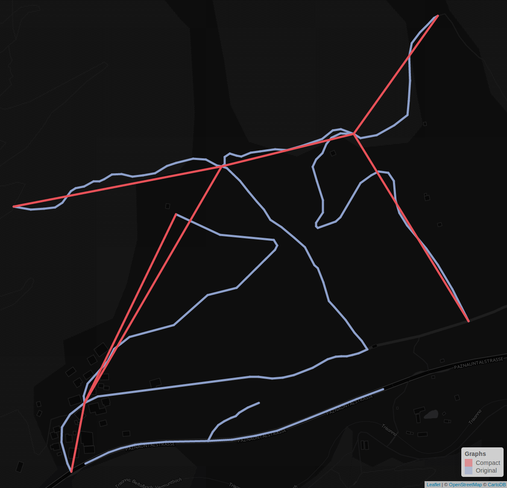
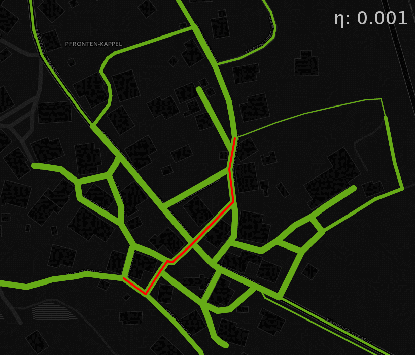

```{r echo=FALSE}
library (magrittr)
dat <- readRDS ("dat_benchmark.rds")
dat_distance <- readRDS ("dat_distance.rds")
```

# Introduction

`osmprob` is an *R* package that allows users to calculate traversal
probabilities and the estimated travel distance between two points on a graph
based on the methods introduced in @saerens2009randomized. It is intended to
serve as a tool for researchers in fields related to city planning, logistics or
transportation in general. With it, they can estimate realistic travelling
distances and patterns by simply executing a few lines of code. The package also
contains methods that simplify the process of downloading and preprocessing road
data on which the routing can be performed. This step also includes weighting
the edges according to a specified means of transport. The values used for
weighting are derived from the Routino weighting profiles[^1], but can also be
adjusted manually. Finally, the results can either be visualised with built-in
mapping functions or used for further analysis.

## *R* packages

*R* is a programming language that is maintained by the *R* Foundation for
Statistical Computing[^2] and is freely available under the GNU General Public
License. *R* uses the concept of packages, which allow users to access
additional functionality from external sources. These packages are written and
maintained by numerous contributors and can be accessed via the Comprehensive R
Archive Network (CRAN)[^3]. The packages are built according to a specific
structure, which is explained in @wickham2015r, which leads to high
interoperability of the contributed software. This software was also built in
form of a package. One reason why this format was chosen was because of its
interoperability. *R* is platform independent an can therefore be used on the
most common operating systems. Its free software license and therefore the
availability of all source code to the user, makes it an excellent research
tool, as it allows all results to be completely reproducible. Looking at papers
like @baker20161, that focus on problems with the reproducibility of other
scientists' experiments, the necessity of such scientific practices becomes
apparent.

## Nomenclature of routing results

"**path** `noun | \ˈpath, ˈpäth\` [...] a sequence of arcs in a network that can
be traced continuously without retracing any arc"  
@mwPath

"**route** `noun | \ˈrüt, ˈrau̇t\` [...] an established or selected course of
travel or action"  
@mwRoute

Usually, the results produced by routing software like implementations of
Dijkstra's algorithm as described in @dijkstra1959note are least-cost edge
sequences called paths or routes. An overview about routing algorithms can be
found in @hall2012handbook. And whilst some of these rely on probabilities in
order to simulate realistic route choice behaviour, the eventual routing results
are still paths. Implementations of the Cross-Nested Logit, Probit and the Logit
Kernel model can be found in @ben2004route. It is important to clarify that the
routing results produced by `osmprob` are not paths, but a set of traversal
probabilities of all edges on the graph and other values derived from that. For
lack of more fitting terminology, they will be referred to as routing results in
this paper.

## Road data

The road data used in this package is taken from the OpenStreetMap project,
a platform that provides open geodata on a global scale. It is maintained by the
@OpenStreetMap. The data is downloaded using the `osmdata` package, which acts
as an efficient handler for the Overpass API[^4] and conveniently downloads and
formats OpenStreetMap data and can therefore be seamlessly integrated in the
routing workflow. The package is authored and maintained by @osmdata.

# Methods

The methods used in this paper include several steps of data preprocessing and
finally the routing functionality. As this paper focuses on more the `osmprob`
package as a whole and not on the routing methodology itself, an in-depth
discussion of @saerens2009randomized is omitted at this point.

## Preprocessing

The OpenStreetMap road data can not be used in its raw form by `osmprob`, but
has to be preprocessed first in order to produce robust results and to minimise
calculation time. According to @dasu2003exploratory, data preprocessing in data
analysis takes up 80% of the time, which shows that it is worthwhile to invest
in the development of a robust and efficient means of data preprocessing. For
this reason, `osmprob` features a completely automated preprocessing routine,
that allows users to input coordinates of a desired region and have the entire
download and data cleaning process run in one go. The computationally expensive
parts of this process were implemented in C++ using the `Rcpp` package, which
brings large improvements in performance, as has been shown by @rcpp2011. The
preprocessing process includes three steps:

- Identifying and isolating the largest connected component in the graph
- Removing vertices that are not needed to preserve the graph's topology
- Mapping the edges of the processed graph back on to the original graph

As there was no software available that performs these steps reliably and highly
performant, they had to be implemented as a part this package. The following
sections illustrate the details of each preprocessing step.

### Identifying largest graph component

Graph based routing algorithms do not work on a disconnected graph. But when
downloading subsets of OpenStreetMap data based on a bounding box, the resulting
graph may consist of several disconnected smaller graphs or components, as
illustrated by the different colours for the vertices showed in figure 1. In
this example, the graph consists of four components, so three of them are going
to be removed in this process. One way to obtain a single connected component,
is to number all separate connected components inside a bounding box
individually, then pick the one component best suitable for the routing process
and delete all others. In this package, the selection is based on the number of
vertices in the component, which is practical for most routing applications.

```{r, fig.align="center", echo=FALSE, engine='tikz',fig.ext='svg', code=readLines("graph_pp1.tex"), fig.cap="Figure 1: Original data, consisting of different graph components"}
```

The following sample of pseudocode illustrates how the largest graph component
is identified.

```{r eval=FALSE}
    component_number = 0

    # initially, set all component numbers to -1 (invalid)
    for vertex in all_vertices
        comp_num.at (vertex) = -1

    for vertex in all_vertices
        set component_numbers # initialise empty set of component numbers

        # insert component numbers of current and all neighbouring vertices
        component_numbers.insert (comp_num.at (vertex))
        for neighbour in vertex.get_neighbours ()
            component_numbers.insert (neighbour)

        # identify biggest component number of current neighbourhood
        largest = max (component_numbers)

        # component number is -1, so this neighbourhood is not in the list yet
        if largest == -1
            largest = component_number
            component_number++

        # assign largest component number to current vertex and its neighbours
        comp_num.at (vertex) = largest
        for neighbour in vertex.get_neighbours ()
            comp_num.at (neighbour) = largest

        # every vertex with a component number listed in component_numbers gets
        # the largest component number, thus combining previously disconnected
        # components
        for cn in comp_num
            if (component_numbers.contains (cn) && cn.component_number != -1
                comp_num.at (cn) = largest

    # remove remaining vertices
    for com in comp_num
        if com != largest
            allVertices.erase (com)
```

At this point every node in the graph has been assigned a component number.
Nodes sharing the same component number are necessarily part of one connected
unit and are disjoint from any nodes with different component numbers.
Therefore, the component number with the highest frequency c~max~ is indicative
of the largest connected component. Now all nodes with component number !=
c~max~ can be stripped off the original graph, which results in exactly one
connected graph.

```{r, fig.align="center", echo=FALSE, engine='tikz',fig.ext='svg', code=readLines("graph_pp2.tex"), fig.cap="Figure 2: Identifying largest component"}
```

### Removing intermediate nodes

All nodes that are not necessary for routing are removed from the graph. This
means that nodes that only have two neighbours and are connected to both of them
either by one-way streets or two-way streets can be removed and the original
edges replaced with new ones connecting the remaining vertices. This constraint
is illustrated in figure 3. Node `B` can be removed in graph 1) and 2), but not
in 3). Applying it to the preprocessing routine ensures that all topological
information of the original graph is preserved.

```{r, fig.align="center", echo=FALSE, engine='tikz',fig.ext='svg', code=readLines("graph_rm_vertex.tex"), fig.cap="Figure 3: Intermediate nodes in one-way, two-way and mixed streets"}
```

Applying these rules to the input graph removes all unnecessary intermediate
vertices, leaving only the vertices that will be part of the final compact
graph.


```{r, fig.align="center", echo=FALSE, engine='tikz',fig.ext='svg', code=readLines("graph_pp3.tex"), fig.cap="Figure 4: Removing intermediate nodes"}
```


### Inserting replaced edges

Removing vertices from a graph implies removing edges. In order to preserve the
original graph's topology, all edges are replaced with topologically equivalent
direct edges between the remaining vertices. And even though this can lead to
more edges leading to and from vertices, all edges keep their distinct IDs and
can at any point be mapped back on the original graph. This way, the routing can
be performed on the compact graph, whilst using the original graph's edge
weights for the calculations and later on its geographical features for
visualisation. The following piece of pseudocode illustrates how vertices and
edges to be removed are identified, replaced with new edges that have
appropriate attributes and finally how these changes in the graph are tracked in
a map of new and replaced edge IDs in order to be able to trace back what parts
of the original graph are represented by their compact counterparts.

```{r eval=FALSE}
    # initialise unique edge ID of replacement edge
    new_edge_id = max (all_edges.get_ids ()) + 1

    # initialise map with replacement edge ID as key and a set of edge IDs as
    # value
    replacements = map (replacement_id, edge_id [])

    for vertex in all_vertices

        # if a vertex has exactly two neighbouring vertices, it can be replaced
        if (vertex.num_neighbours () == 2)

            # initialise values for replacement edge
            new_edge_weight = 0
            new_edge_start
            new_edge_end
            # initialise counter for number of edges to be replaced
            edges_replaced = 0

            for edge in all_edges
                # if current vertex is part of the current edge, replace edge
                if (edge.get_start () == vertex || edge.get_end () == vertex)

                    # depending on which of the two edges linked to the current
                    # vertex is selected, set new edge parameters and update
                    # neighbours of the neighbouring vertices
                    if (edge.get_start () == vertex)
                        new_edge_end () = edge.get_end ()
                        neighbour_1 = vertex.get_neighbour_from ()
                        neighbour_1.set_neighbour_to (edge.get_end ())
                    if (edge.get_end () == vertex)
                        new_edge_start = edge.get_start ()
                        neighbour_2 = vertex.get_neighbour_to ()
                        neighbour_2.set_neighbour_to (edge.get_start ())

                    # update new edge parameters
                    new_edge_weight += edge.get_weight ()

                    # update map of replaced edge IDs
                    edges_rep = replacements.get (new_edge_id)
                    edges_rep.insert (edge.get_id ())
                    replacements.set (new_edge_id)

                    # remove edge and increment edge counter 
                    edge.remove ()
                    edges_replaced ++

                    # if both edges are found and removed, insert new one and
                    # remove current vertex
                    if (edges_replaced == 2)
                        replacement = edge (new_edge_start, new_edge_end,
                                            new_edge_weight, new_edge_id)
                        edges.insert_edge (replacement)
                        vertex.remove ()
                        new_edge_id ++ # increment new edge ID for next edge
```

```{r, fig.align="center", echo=FALSE, engine='tikz',fig.ext='svg', code=readLines("graph_pp4.tex"), fig.cap="Figure 5: Inserting edges between remaining nodes"}
```

Figure 6 shows a real world example of the principles outlined above. The
original graph displayed in blue is replaced by the red compact graph that only
contains the nodes necessary to maintain the original topology. The small
disjoint part of the original graph has been removed, as it is not accessible
from the main graph and can therefore not be used in the routing process.



## Routing

After the preprocessing is done, the graph can be used for routing purposes. The
routing function is an implementation of the methods proposed in
@saerens2009randomized. It calculates for each edge in the graph the probability
of it being traversed on the way from a starting to an end point based on two
factors. One is the edge weight, which in `osmprob` is a function of the
geographic distance and the road type. The second one is a nondimensional value
that @saerens2009randomized refer to as $\eta$. Its value is used to quantify
the global entropy that the routing algorithm uses in that for $\eta$
approximating 0, the global entropy rises. Part of this paper is to understand
the influence that different $\eta$ have on the calculation times and routing
results and how to tune $\eta$ in a way that it leads to good routing results.
Using these methods for routing leads to a probabilistic rather than
deterministic routing result, which is why this routing method is fundamentally
different to the ones mentioned in the introduction.

# Installation

```{r eval=FALSE}
devtools::install ("osm-router/osmprob")
```

# Usage

The only input needed to download street data are the coordinates of the start
and end points on the graph. The `download_graph` function builds a bounding box
including an optional buffer around the points and downloads all OpenStreetMap
data tagged as `key = highway`[^5] in it.

```{r eval=FALSE}
start_pt <- c (10.5350035429,47.6034937672)
end_pt <- c (10.5384796858,47.6071612749)
graph <- download_graph (start_pt, end_pt)
```

The function `select_vertices_by_coordinates` then identifies the vertices on
the graph that lie closest to the desired start and end points.  These are the
points based on which the routing process will be performed.

```{r eval=FALSE}
pts <- select_vertices_by_coordinates (graph, start_pt, end_pt)
route_start <- pts[1]
route_end <- pts [2]
```

At the moment, there are two routing algorithms implemented in this package and
accessible by using `get_shortest_path` and `get_probability`, respectively. For
the sake of consistency, the object returned by both functions is a `list`
containing a `data.frame` with all relevant edges as a first item and the
calculated distance as a second item. `get_shortest_path` returns the shortest
path as calculated using an implementation of Dijkstra's algorithm. The call
`path$d` in the following example is used to access the path's calculated
distance in km.

```{r eval=FALSE}
path <- get_shortest_path (graph, route_start, route_end)
path$d # 0.1427
```

`get_probability` calculates the traversal probability for the entire input
graph. It returns the entire input graph with additional columns containing the
global and local traversal probability for each edge. Like `get_shortest_path`,
it returns a `list` object. The first entry is a `data.frame` with all edge, to
which have been added two additional columns. They contain the routing
probabilities for all edges in two different formats:

* `prob`: The local routing probabilities from every vertex to all its
  neighbouring vertices. These values are the ones originally calculated in the
  routing algorithm. The probability densities and expected mean travel distance
  is derived from them. Because all values of `prob` add up to 1 on a local
  scale, they are hard to interpret on a global scale. This is why it is also
  necessary to calculate the global routing probabilities.
* `dens`: The global routing probabilities or routing densities. These values
  are derived from `prob` and indicate how likely an edge on the graph will be
  traversed on the way from start to end. As these values are easier to
  interpret than `prob`, they are used for graph visualisation.

The second item in the returned list is the expected travel distance which is
based on the calculated traversal probabilities. Its minimal possible value is
the length of the shortest path and gets higher with increased global entropy,
which can be done using lower values for $\eta$ (`eta`). Note that the distance
rises very abrupt for $\eta$ approximating 0. The results section contains more
information about the effects of $\eta$ on the routing results.

```{r eval=FALSE}
prob <- get_probability (graph, route_start, route_end, eta = 0.9)
prob$d # 0.1934
prob <- get_probability (graph, route_start, route_end, eta = 0.7)
prob$d # 0.2001
prob <- get_probability (graph, route_start, route_end, eta = 0.3)
prob$d # 0.2418
prob <- get_probability (graph, route_start, route_end, eta = 0.01)
prob$d # 1.3040
```

Finally, the routing results can be visualised with the **shiny** **leaflet**
mapping function.

```{r eval=FALSE}
plot_map (prob, path)
```

# Results

The following section discusses the results achieved using `osmprob`. It also
evaluates performance analysis from real world use cases and further shows the
influence that different $\eta$ have on such statistics. The tests were run on
18 different randomly selected test regions, applying 56 different values for
$\eta$ in each case. To reduce the chance of faulty outliers, the results of all
speed measurements given are the median time of runs.

## Routing probabilities

Figure 7 shows the probabilistic routing results on a road graph and shows very
clearly the influence that different $\eta$ have on the results. The red line on
the graph indicates the shortest path between a start and end point. The line
thickness on the green lines indicates the traversal probability on each edge on
the way between these two points. As discussed above, high $\eta$ mean a low
global entropy and vice versa. Low global entropy means that the proposed edge
traversal probabilities are higher when they are close to the ideal path. On the
street network, this almost looks like the traversal probabilities resembling
the shortest path. If this is the case, only very close alternative routes that
don't necessitate large detours also have elevated probabilities. On the other
hand, low $\eta$ lead to the probabilities "seeping away" from the ideal path.
This can be observed by looking at the edges that are quite thin for high
$\eta$, but constantly become thicker with decreasing $\eta$, which is
consistent with the initial expectations This effect also implies that the edges
with higher probabilities for large $\eta$ will decrease in probability as the
others around it will increase.



Figure 8 shows the effects caused by different $\eta$ on the routing results
described above on a numeric scale. Each line represents one pair of start and
end points on a graph. The coloured dots sitting on that line indicate the value
of $\eta$ used for the calculation. As stated above, high global entropy means
that more edges of a graph are likely to being traversed, thereby increasing the
expected mean distance of the trips. The rampant increase in expected distance
also indicates that for low $\eta$, slight changes have quite a big effect. This
may even lead to estimated mean distances bigger than the sum of all edge
lengths present in the graph, which is possible because random movement on the
graph does not restrict the number of times a given edge can be traversed. The
curves in the figure also suggest a way of extracting values for $\eta$. The
points shown in red represent the estimated ideal $\eta$ based on the points of
inflexion on the probabilistic distance data.

```{r echo=FALSE, fig.cap="Figure 8: Mean distances for different values of global entropy"}
ttl <- "Estimated mean distances for different values of global entropy"
xlab <- substitute (paste ("Global entropy [",eta, "] (log scale)"))
legendlab <- substitute (paste ("Global entropy [", eta, "]"))

inf_pts <- vector (length = length (unique (dat$region_num)), mode = "numeric")
for (i in seq (unique (dat$region_num)))
{
    rn <- dat$region_num [i]
    dists <- dat$d_prob [dat$region_num == rn]
    inf <- inflection::ede (unique (dat$eta), dists, 0)
    inf_pts [i] <- inf [1]
}
extr <- inf_pts + (0:(length (inf_pts) - 1) * length (unique (dat$eta)))
inf_plot <- dat [extr,]
inf_ln <- unique (inf_plot$eta) %>% round (3)
inc_factor <- (inf_plot$d_prob / inf_plot$d_shortest) %>% median %>%
    round (2) %>% format (2)

plt <- ggplot2::ggplot (data = dat) +
    ggplot2::geom_line (ggplot2::aes (x = eta, y = d_prob, group = region_num),
                        colour = "#333333") +
    ggplot2::geom_point (ggplot2::aes (x = eta, y = d_prob), size = 0.5) +
    ggplot2::geom_point (data = inf_plot, ggplot2::aes (x = eta, y = d_prob),
                         size = 1.5, colour = "#FF0000") +
    ggplot2::labs (title = ttl, x = xlab, y = "Distance [km] (log scale)") +
    ggplot2::theme_bw (base_family = "TeX Gyre Bonum") +
    ggplot2::theme (plot.title = ggplot2::element_text(hjust = 0.5),
                    legend.box.background = ggplot2::element_rect ()) +
    ggplot2::scale_colour_discrete (name = legendlab) +
    ggplot2::geom_vline (xintercept = inf_ln, colour = "#FF0000", linetype =
                         "dashed") +
    ggplot2::scale_x_continuous (trans = "log",
                                 breaks = c (0.001, 0.01, 0.1, 1, 7, inf_ln)) +
    ggplot2::scale_y_continuous (trans = "log",
                                 breaks = c (0.1, seq (2, 8, by = 2) / 10, 1.5,
                                             1:4))

plt
```

Using the estimated ideal $\eta$ to determine the realistic mean travel
distance, the median value of distances is `r inc_factor` times the shortest
distance. Because $\eta$ is the same value for the points of inflexion in all
curves, it suggests that there might be one universally applicable value for all
applications. A comparison of these estimations and real world data, however
would be useful to validate this.

## Speed

Figures 9 and 10 show how the calculation time is affected by the graph size and
the network distance between start and end point. They also give an indication
of the performance difference between probabilistic routing and classic shortest
path solutions at the example of Dijkstra's algorithm. The graphs further
indicate that different values for $\eta$ may also have an influence on
calculation time. Specifically, low $\eta$ and thus high global entropies
appear to be leading to longer calculation times. What becomes obvious is that
the calculation times for probabilistic routing are consistently higher than the
shortest path calculations, which is in accordance to the initial expectations
due to the more complex nature of the probabilistic routing process. The speed
tests were run using a Intel i5-2400 CPU 3.10GHz × 4 processor.

```{r echo=FALSE, fig.cap="Figure 9: Calculation times for different shortest path alternatives"}
clrs <- RColorBrewer::brewer.pal (name = "YlGnBu", 9) [3:9]

ttl <- "Calculation times for network distances
and values of global entropy"
legendlab <- substitute (paste ("Global entropy [", eta, "]"))

plt <- ggplot2::ggplot (data = dat) +
    ggplot2::geom_line (ggplot2::aes (x = d_shortest, y = 1000 * t_prob, group = eta, colour = eta)) +
    ggplot2::geom_line (ggplot2::aes (x = d_shortest, y = 1000 * t_shortest), size = 1) +
    ggplot2::labs (title = ttl,
                   x = "Distance of shortest path [km]",
                   y = "Time (median of n = 30 runs) [ms]") +
    ggplot2::theme_bw (base_family = "TeX Gyre Bonum") +
    ggplot2::theme (plot.title = ggplot2::element_text(hjust = 0.5),
                    legend.box.background = ggplot2::element_rect ()) +
    ggplot2::scale_colour_gradientn (colours = clrs, name = legendlab)

plt
```

```{r echo=FALSE, fig.cap="Figure 10: Calculation times for different graph sizes"}
ttl <- "Calculation times for different graph sizes
and values of global entropy"
legendlab <- substitute (paste ("Global entropy [", eta, "]"))

plt <- ggplot2::ggplot (data = dat) +
    ggplot2::geom_line (ggplot2::aes (x = n_vtx_comp, y = t_prob, group = eta, colour = eta)) +
    ggplot2::geom_line (ggplot2::aes (x = n_vtx_comp, y = t_shortest), size = 1) +
    ggplot2::labs (title = ttl,
                   x = "Number of vertices in graph",
                   y = "Time (median of n = 30 runs) [ms]") +
    ggplot2::theme_bw (base_family = "TeX Gyre Bonum") +
    ggplot2::theme (plot.title = ggplot2::element_text(hjust = 0.5),
                    legend.box.background = ggplot2::element_rect ()) +
    ggplot2::scale_colour_gradientn (colours = clrs, name = legendlab)

plt
```

## Comparison with shortest path solutions

```{r echo=FALSE}
flt <- seq (dat$d_shortest)
sd_short <- dat$d_shortest [seq (1, length (flt), 7)] %>% sd %>% round (3) %>%
    format (nsmall = 3)
```

Figure 11 shows the calculated probabilistic distances for different $\eta$ in
comparison with the shortest path distances. As expected, all probabilistic
distances are longer than the shortest path. The graph also shows how sensitive
$\eta$ becomes when approximating 0. Note that a change in $\eta$ from 0.003 to
0.001 leads to an estimated distance of almost twice the length. Another
observation that can be made is that the probabilistic distances alter quite a
lot from one another. Table 1 shows the standard deviations of the expected
distances for different $\eta$, which are very high in comparison with the
standard deviation of the shortest paths (`r sd_short`). And like the distances,
their standard deviations are very sensitive to $\eta$. Another possible reason
for the spikes in the probabilistic distances could be the number of vertices in
the road graph, because a more complex road graph would allow more movement
between a start and end point than a very simple one would.  So on a very simple
graph, all movement would be restricted on few edges, even with high $\eta$.

```{r echo=FALSE, results = 'asis'}
v <- aggregate (dat$d_prob, by = list (eta = dat$eta), FUN = sd)
qnt <- c (1:10) / 10
vperc <- lapply (v, quantile, probs = qnt, name = FALSE) %>% data.frame
colnames (vperc) [1] <- "eta <"
colnames (vperc) [2] <- "Standard deviation [km]"
knitr::kable (vperc, digits = 4, format = "pandoc",
              caption = "Table 1: Variances in probabilistic distance
              (split into deciles)")
```

```{r echo=FALSE, fig.cap="Figure 11: Comparison of probabilistic and shortest path solutions: distance"}
ttl <- "Number of traversed edges for shortest
and probabilistic routes"
legendlab <- substitute (paste ("Global entropy [", eta, "]"))

plt <- ggplot2::ggplot (data = dat_distance) +
    ggplot2::geom_line (ggplot2::aes (x = d_shortest, y = d_prob, group = eta, colour = eta)) +
    ggplot2::labs (title = ttl,
                   x = "Shortest Distance",
                   y = "Probabilistic distance") +
    ggplot2::theme_bw (base_family = "TeX Gyre Bonum") +
    ggplot2::theme (plot.title = ggplot2::element_text(hjust = 0.5),
                    legend.box.background = ggplot2::element_rect ()) +
    ggplot2::scale_colour_gradientn (colours = clrs, name = legendlab,
                                     trans = "log",
                                     breaks = c (0.0001, 0.001, 0.01,0.1, 1, 7))

plt
```

## Limitations

In some test regions it was not possible to calculate probabilistic routes due
to unexpected behaviour of `osmprob`. This includes program crashes, as well as
the generation of unreasonably high values of estimated travel distances. The
reasons leading these effects are yet to be identified. One possible explanation
could be that under certain circumstances the software is attempting to perform
routing on ill-formed graphs. This may happen when a graph is complete, but
certain vertices are inaccessible due to directed edges leading only away from
and not towards them. But despite these issues, the software performed as
expected and could be used to produce viable results.


# Discussion and outlook

The results show that `osmprob` can be used to not only adequately perform
probabilistic routing tasks and is therefore fit for use in real world
applications, it also supports the user in the process of data collection and
preprocessing. This makes it very easy also for inexperienced users to
facilitate the methods presented in this paper.  The resulting traversal
probabilities appear to represent realistic movement patterns for their
respective $\eta$. The method for estimating $\eta$, however, is still to be
investigated further. While the method of estimating $\eta$ based on the
behaviour of mean distances suggests good results, a comparison with real world
movement data would be useful to validate and refine it.

# References

[^1]: https://www.routino.org/xml/routino-profiles.xml
[^2]: https://www.r-project.org/
[^3]: https://cran.r-project.org/
[^4]: http://wiki.openstreetmap.org/wiki/Overpass_API
[^5]: http://wiki.openstreetmap.org/wiki/Key:highway
